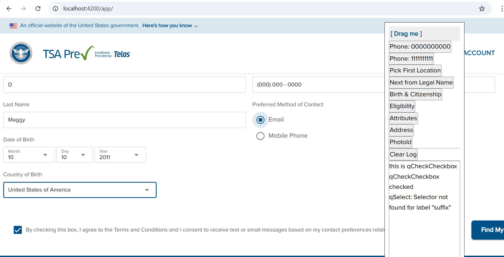

# playwright_mediated_tool repo
https://github.com/mulefish/playwright_mediated_tool

# WHat is a 'computer mediated tool'?
Use Playwright to move the web quickly into a reasonible state but allow the end user to also interact with the WebApp. 

# Security
This repo contains ZERO secrets. 
Further, it is targetted at an app that runs on 'localhost' AND needs a VPN to function. 

# Mobile 
cd mobile 
node device_zoo.js 

# interactive 
cd interactive   
node main_twe.js < launch 4200 twe >   
OR  
node main_backend.js < launch 4202 backend >   
OR
npm run twe < launch 4200 twe > 
OR
npm run backend  < launch 4202 backend > 

# screenshot
